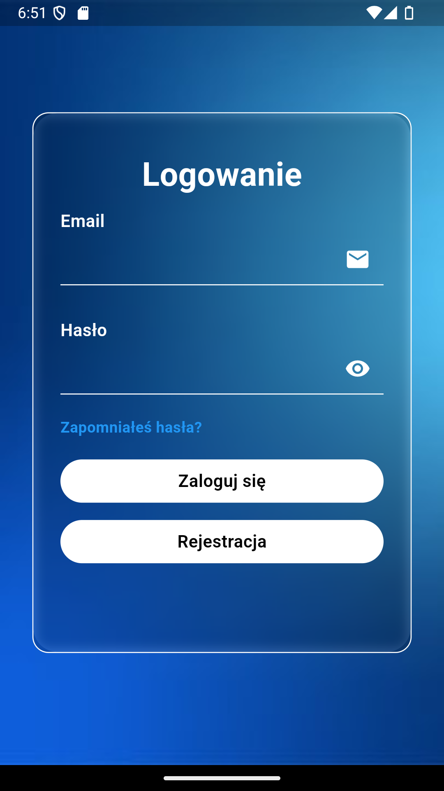
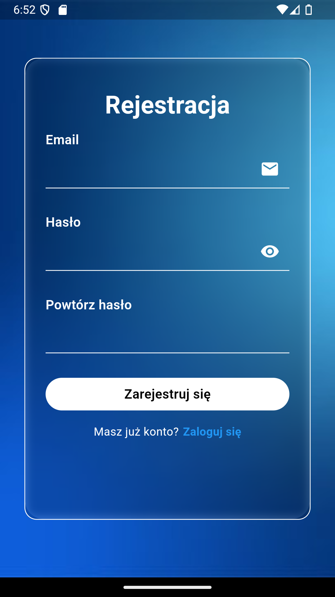
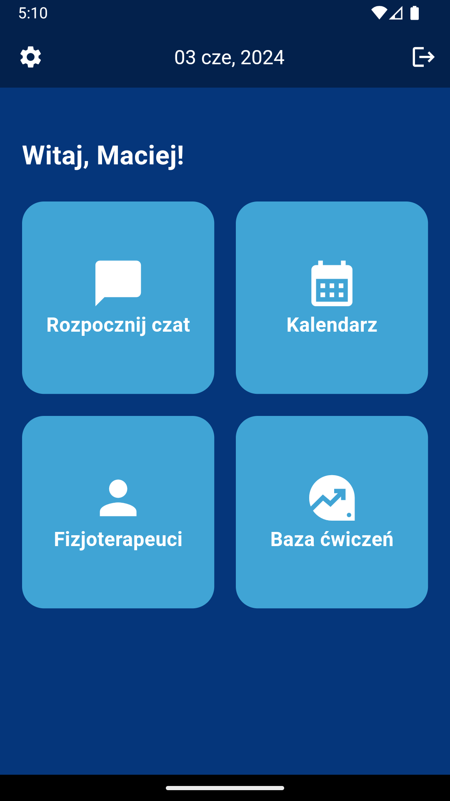
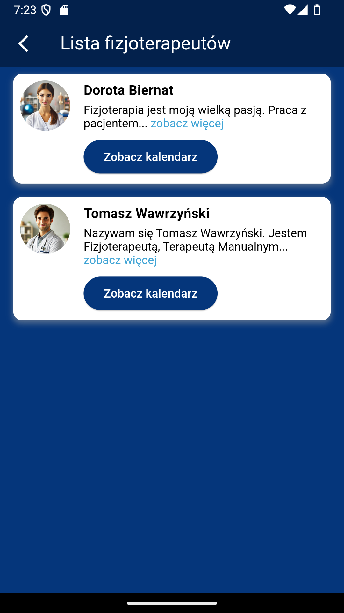
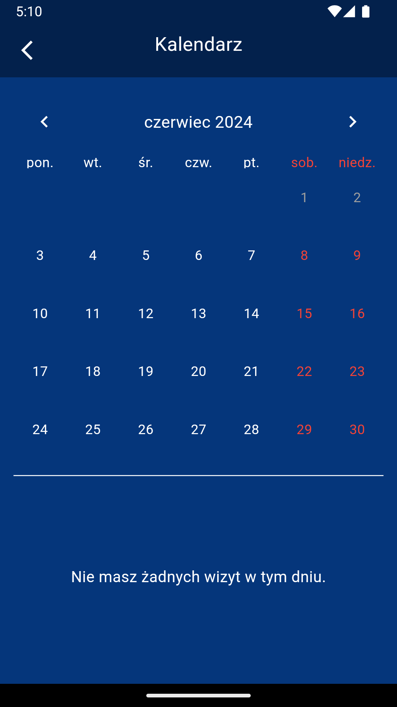
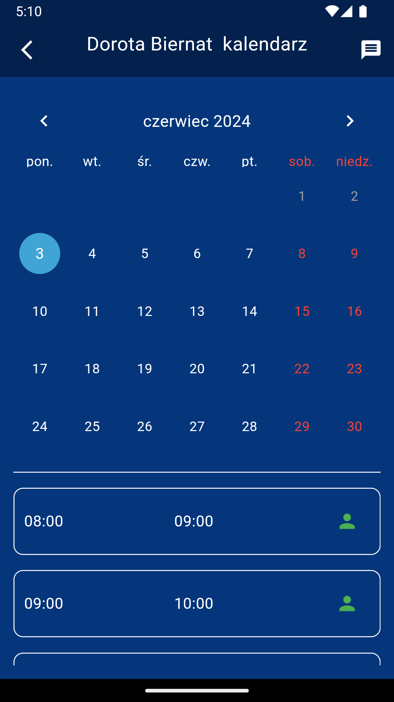
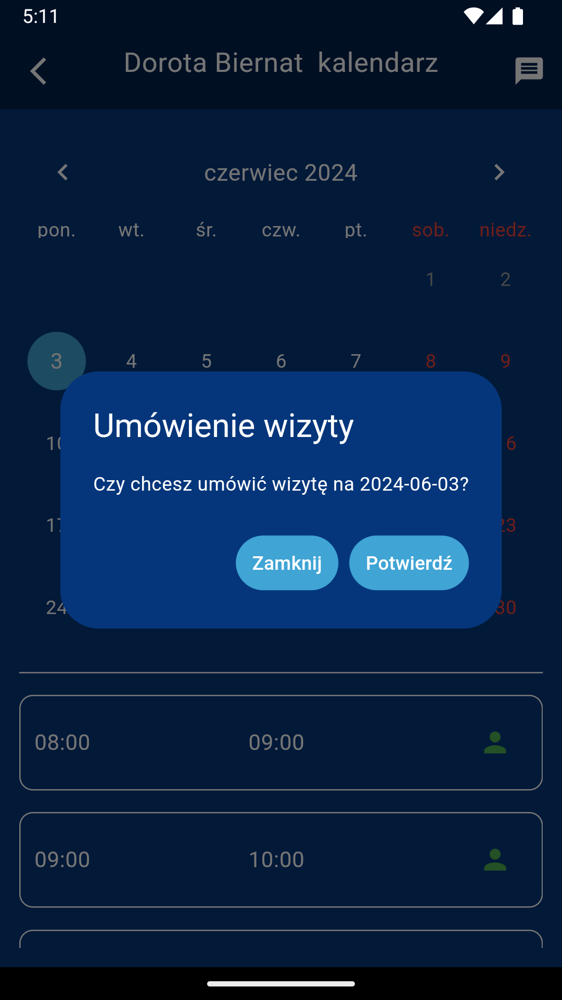
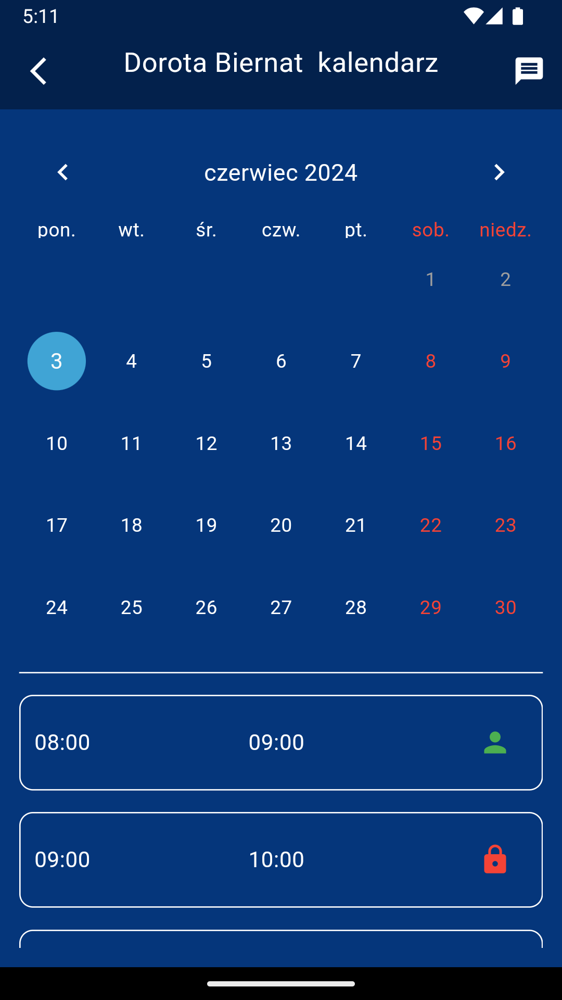
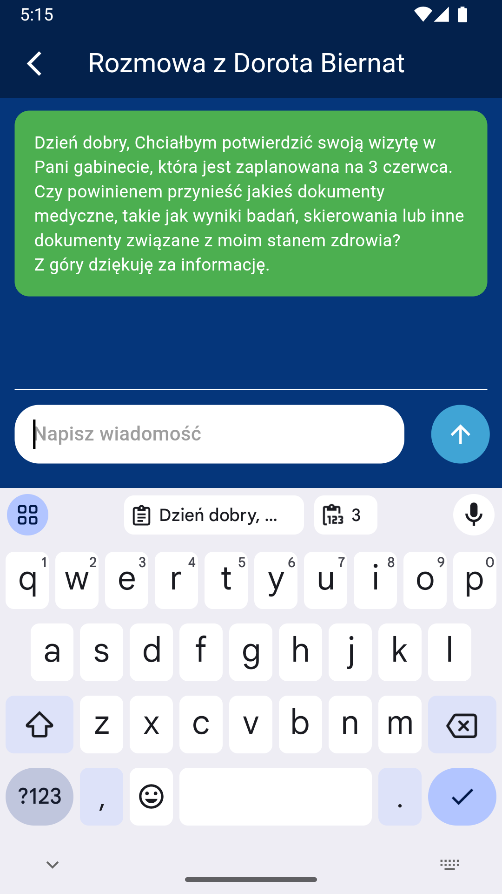
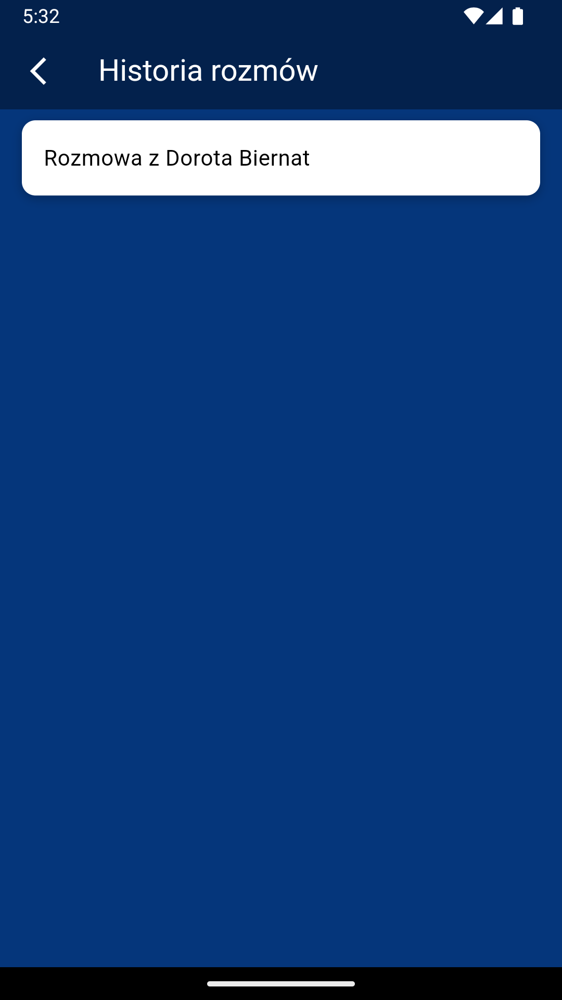

# Aplikacja mobilna wspomagające rehabilitacje pacjentów

Aplikacja umożliwia stworzenia konta pacjenta i fizjoterapeuty w celu umożliwienia konwersacji, umówienia wizyty. Dodatkowo posiada
baze danych z protokołami postępowania rehabilitacyjnego po najczęściej spotykanych urazach i w jednostkach chorobowych (przykład protokołu: https://www.melbourneaclguide.com/docs/ACL_Guide.pdf).  
Program wspomagany jest przez serwer na którym znajdują się dane użytkowników, konwersacji, spotkań oraz protokołów postępowania. 

## Przykładowe screenshory z aplikacji

